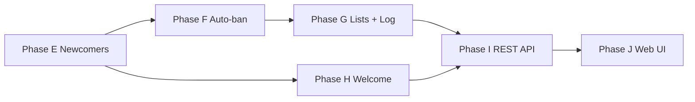

# Moderation & Web Admin — Implementation Plan (Phases E–J)

> **Goal:** Automate group member management (newcomer limits, rule-based bans, lists, welcome messages) and provide a **web dashboard** for configuration and stats.  
> **Prerequisite:** Phases A–D complete (per-group settings, moderators, capture pipeline).  
> **Status:** Draft — awaiting confirmation and [DECISIONS.md](./DECISIONS.md) answers.

---

## Needs analysis

### What you asked for

| # | Need | Core value |
|---|------|------------|
| 1 | **Newcomer limitations** | Reduce spam/flood from fresh accounts before they earn trust |
| 2 | **Auto-ban rules** | Scale moderation: keywords, nicknames, external trust score on join |
| 3 | **Action log + black/white lists** | Auditability, overrides, appeal workflow prep |
| 4 | **Configurable welcome** | Onboard legitimate members (text, image, buttons) |
| 5 | **Web UI** | Telegram `/admin` does not scale for moderation complexity |
| 6 | **Basic stats** | See if rules work; volume of Q&A and moderation |

### Telegram reality check

| Target | Join events | Ban/restrict | Welcome on join | Bot permissions |
|--------|-------------|--------------|-----------------|-----------------|
| **Supergroup** | ✅ `chat_member` updates | ✅ if bot is admin | ✅ | `can_restrict_members`, `can_delete_messages` |
| **Broadcast channel** | ❌ no member join events to bot | ❌ N/A (no chat) | ❌ | Bot is admin poster only |
| **Linked discussion group** | ✅ same as supergroup | ✅ | ✅ | Recommended target if you use channels |

**Assumption in this plan:** primary target is **supergroups** (and linked discussion groups). Broadcast-only channel moderation is out of scope unless you confirm otherwise — see [DECISIONS.md](./DECISIONS.md) #1.

### What exists today (reuse)

| Asset | Reuse for |
|-------|-----------|
| `ManagedGroup` + `GroupSettings` JSON | Extend with `moderation` blob or normalize to tables |
| `chat-member.ts` (`my_chat_member`) | Extend to `chat_member` for user joins |
| `GroupConfigService` | Per-group policy loading |
| `MessageCaptureService` / filters | Hook newcomer message enforcement |
| `QuestionLog` | Stats: Q&A volume |
| `moderatorUserIds` | Web UI auth mapping (partial) |
| Docker + Postgres | Host API + web as extra service |

### Gap

- No member identity tracking (join time, first messages)
- No Telegram `banChatMember` / `restrictChatMember` integration
- No rule engine or audit log
- No HTTP API or web frontend
- Welcome is global/DM-only text, not per-group rich message on join

---

## Target architecture (after E–J)

```mermaid
flowchart TB
    subgraph telegram [Telegram]
        Group[Supergroup]
        Web[Web Admin Browser]
    end

    subgraph bot [Bot Process]
        Grammy[Grammy handlers]
        Join[JoinHandler]
        ModEngine[ModerationEngine]
        Newcomer[NewcomerPolicyService]
        Trust[TrustScoreClient mock]
        Welcome[WelcomeService]
    end

    subgraph api [Admin API - new]
        REST[REST API]
        Auth[Session / API key]
        Stats[StatsAggregator]
    end

    subgraph web [Web UI - new]
        Dashboard[Dashboard SPA]
    end

    subgraph db [(PostgreSQL)]
        Members[GroupMember]
        Rules[ModerationRule]
        Lists[AccessList]
        Log[ModerationActionLog]
        WelcomeCfg[WelcomeConfig]
    end

    Group -->|chat_member + messages| Join
    Join --> ModEngine
    ModEngine --> Trust
    ModEngine --> Newcomer
    ModEngine --> Welcome
    ModEngine --> Log
    ModEngine --> Lists
    Web --> Dashboard --> REST
    REST --> db
    Grammy --> ModEngine
    Stats --> db
```

---

## Domain model (proposed)

### Per-group moderation settings (`ModerationSettings` in JSON or table)

```typescript
interface ModerationSettings {
  enabled: boolean;

  newcomer: {
    enabled: boolean;
    gracePeriodHours: number;        // 0 = instant full member
    restrictOnJoin: boolean;         // apply Telegram restrict until grace ends
    allowedContentTypes: ContentType[]; // text | photo | video | document | link | sticker | voice
    maxMessagesPerHour: number;
    blockLinks: boolean;
    blockForwards: boolean;
  };

  autoBan: {
    enabled: boolean;
    keywordRules: KeywordRule[];     // first message + nickname
    trustScore: {
      enabled: boolean;
      blockAbove: number;            // mock: 0–100
      restrictAbove: number;
      timeoutMs: number;
    };
  };

  welcome: {
    enabled: boolean;
    deleteJoinServiceMessage: boolean;
    // rich payload stored in WelcomeConfig table
  };
}

type ContentType = "text" | "photo" | "video" | "document" | "audio" | "voice" | "sticker" | "animation" | "poll" | "link";
```

### New Prisma models (high level)

| Model | Purpose |
|-------|---------|
| `GroupMember` | `chatId`, `userId`, `joinedAt`, `firstMessageAt`, `nickname`, `status` (active/restricted/banned/left) |
| `ModerationRule` | Optional normalized rules (alternative to JSON-only) |
| `AccessListEntry` | Blacklist/whitelist: `chatId?` (global if null), `userId`, `listType`, `reason`, `createdBy` |
| `ModerationActionLog` | Every automated/manual action: type, target, ruleId, score, payload, result |
| `WelcomeConfig` | Per-group: text, media file_id/URL, button JSON |
| `DailyStats` (optional) | Aggregated counters for dashboard speed |

---

## External trust API (mock contract)

You will plug a real API later. v1 mock:

```typescript
// POST {TRUST_SCORE_URL}/check
interface TrustScoreRequest {
  botInstanceId: string;
  chatId: string;
  userId: string;
  username?: string;
  firstName?: string;
  lastName?: string;
  isPremium?: boolean;
  joinedAt: string;
}

interface TrustScoreResponse {
  score: number;          // 0 = trusted, 100 = bot/spam
  labels: string[];       // e.g. ["new_account", "suspicious_username"]
  action: "allow" | "restrict" | "ban";  // suggestion
  raw?: unknown;
}
```

**Mock client:** deterministic score from username hash; logs request.  
**Flow:** on join → call client → if `score >= blockAbove` → `banChatMember`; elif `restrictAbove` → `restrictChatMember`; else allow + newcomer policy.

---

## Phase breakdown

### Phase E — Member tracking + newcomer policy

**Outcome:** Bot knows who joined when; newcomers face content/time limits.

| # | Task | Detail |
|---|------|--------|
| E.1 | `chat_member` handler | Listen for `member`/`restricted` status; upsert `GroupMember` |
| E.2 | `NewcomerPolicyService` | `isNewcomer()`, `canPostContentType()`, rate limit |
| E.3 | Message gate | In `messages.ts` (before capture/RAG): delete or warn if violation |
| E.4 | Restrict on join | `restrictChatMember` with minimal permissions if `restrictOnJoin` |
| E.5 | Grace period job | Scheduled unrestrict (in-process timer or worker) |
| E.6 | Admin config | Extend group settings (Telegram admin minimal); schema migration |
| E.7 | Tests | Policy unit tests |

**Exit criteria:**
- [ ] New member restricted per config until grace period ends
- [ ] Link/media blocked for newcomers when configured
- [ ] Violations logged (prep for Phase G)

**Estimate:** 4–5 days

---

### Phase F — Rule engine + auto-ban + trust mock

**Outcome:** Automated ban/restrict based on keywords, nickname, mock trust API.

| # | Task | Detail |
|---|------|--------|
| F.1 | `ModerationEngine` | Central orchestrator: evaluate join + first message |
| F.2 | Keyword / nickname rules | Regex or substring lists per group |
| F.3 | `TrustScoreClient` | Mock + HTTP stub (`TRUST_SCORE_URL`) |
| F.4 | Telegram actions | `banChatMember`, `restrictChatMember`, `unbanChatMember` wrappers |
| F.5 | First-message detection | Track `firstMessageAt` on `GroupMember`; run rules once |
| F.6 | Fail-safe | API timeout → restrict (configurable) not silent allow |
| F.7 | Bot permission check | Warn admins if bot lacks rights |

**Exit criteria:**
- [ ] Join with bad nickname → banned per rule
- [ ] First message with blocked keyword → action taken
- [ ] Mock trust API logs and returns score; high score bans
- [ ] Whitelist skips all rules (Phase G lists can stub early)

**Estimate:** 5–6 days

---

### Phase G — Access lists + moderation audit log

**Outcome:** Blacklist/whitelist overrides; full log of automated actions.

| # | Task | Detail |
|---|------|--------|
| G.1 | `AccessListService` | CRUD blacklist/whitelist (global + per-group) |
| G.2 | Priority | Whitelist > blacklist > rules > newcomer |
| G.3 | `ModerationActionLog` | Persist every action with JSON context |
| G.4 | Telegram commands | `/ban`, `/unban` for mods (optional, thin) |
| G.5 | Export | JSON CSV export endpoint prep for web |

**Exit criteria:**
- [ ] Whitelisted user never auto-banned
- [ ] Blacklisted user banned on join
- [ ] Log queryable by chatId, userId, date, action type

**Estimate:** 3–4 days

---

### Phase H — Rich welcome messages

**Outcome:** Per-group welcome on join with text, image, inline buttons.

| # | Task | Detail |
|---|------|--------|
| H.1 | `WelcomeConfig` model | text (HTML), photo file_id or URL, buttons |
| H.2 | `WelcomeService` | Send on join; template vars `{name}`, `{username}`, `{group}` |
| H.3 | Delete join service message | Optional `deleteMessage` |
| H.4 | Button actions | `url`, `callback` (rules link), `start` payload |
| H.5 | Preview | Send test welcome to admin DM |

**Exit criteria:**
- [ ] New member receives configured welcome
- [ ] Image + inline buttons render correctly
- [ ] Per-group config independent of global `/start` welcome

**Estimate:** 3–4 days

---

### Phase I — Admin REST API + auth

**Outcome:** HTTP API for all bot config + moderation; foundation for web UI.

| # | Task | Detail |
|---|------|--------|
| I.1 | API server | Hono or Express colocated in `src/api/` or separate `admin-api` package |
| I.2 | Auth | API key + session cookie; map to `ADMIN_USER_IDS` / mod list |
| I.3 | Routes | Groups, moderation settings, rules, lists, welcome, logs (read) |
| I.4 | Stats endpoints | Aggregates from `QuestionLog`, `ModerationActionLog`, `GroupMember` |
| I.5 | OpenAPI | `openapi.yaml` for frontend codegen |
| I.6 | Docker | Second port `ADMIN_API_PORT`; compose service `admin-api` |

**Suggested stats (v1):**

| Metric | Source |
|--------|--------|
| Questions / day | `QuestionLog` |
| Answers by source (rag/community/none) | `QuestionLog` |
| Joins / bans / restricts / deletes | `ModerationActionLog` |
| Active members per group | `GroupMember` |
| Newcomer violations | `ModerationActionLog` type filter |

**Exit criteria:**
- [ ] CRUD moderation settings via API
- [ ] Log pagination + filters
- [ ] Stats JSON for last 7/30 days
- [ ] Auth required on all mutating routes

**Estimate:** 5–7 days

---

### Phase J — Web dashboard (SPA)

**Outcome:** Browser UI for operators; reduces Telegram admin burden.

| # | Task | Detail |
|---|------|--------|
| J.1 | Frontend stack | Vite + React (or SvelteKit) in `web/` |
| J.2 | Pages | Dashboard, Groups, Moderation, Lists, Welcome editor, Logs, Settings |
| J.3 | Welcome editor | Text + image upload (via bot file API proxy) + button builder |
| J.4 | Rule builder | Keyword/nickname forms; trust score thresholds |
| J.5 | Log viewer | Table + filters + detail drawer |
| J.6 | Deploy | Static build served by API or nginx sidecar in compose |

**Exit criteria:**
- [ ] Operator can configure full moderation without `/admin`
- [ ] Dashboard shows v1 stats charts (simple tables OK for v1)
- [ ] Telegram `/admin` kept for mobile quick tweaks (not removed)

**Estimate:** 8–12 days

---

## Dependency graph



| Phase | Depends on | Can parallelize with |
|-------|------------|----------------------|
| E | A–D (group settings) | — |
| F | E | H (partially) |
| G | F | H |
| H | E (join handler) | F, G |
| I | G, H | — |
| J | I | — |

**Recommended order:** E → F → G → H → I → J (or E → H in parallel after E.1).

---

## PR stack (proposed)

| PR | Phase | Title |
|----|-------|-------|
| PR-11 | E | `feat(moderation): GroupMember + newcomer policy` |
| PR-12 | E | `feat(moderation): message gate + restrict on join` |
| PR-13 | F | `feat(moderation): rule engine + trust score mock` |
| PR-14 | F | `feat(moderation): telegram ban/restrict actions` |
| PR-15 | G | `feat(moderation): access lists + action log` |
| PR-16 | H | `feat(moderation): rich welcome messages` |
| PR-17 | I | `feat(api): admin REST API + stats` |
| PR-18 | J | `feat(web): dashboard SPA` |

---

## Config & env (cumulative)

```bash
# Phase F
TRUST_SCORE_URL=
TRUST_SCORE_API_KEY=
TRUST_SCORE_TIMEOUT_MS=3000
TRUST_SCORE_FAIL_ACTION=restrict   # restrict | allow | ban

# Phase I
ADMIN_API_PORT=3001
ADMIN_API_SECRET=                 # session/API key signing
ADMIN_CORS_ORIGIN=http://localhost:5173

# Phase J
VITE_API_URL=http://localhost:3001
```

---

## Bot permissions checklist (for group admins)

Promote bot to **administrator** with:

- ✅ Delete messages
- ✅ Ban users
- ✅ Restrict members
- ✅ Invite users (optional)
- ❌ Anonymous admin not required

Document in `docs/admin/group-setup.md` after implementation.

---

## Out of scope (v1)

- ML-based spam classifiers
- Captcha / button-press to unlock (Phase K candidate)
- Appeals workflow / ticket system
- Multi-language rule packs
- Broadcast channel subscriber moderation
- Replacing Telegram entirely for RAG Q&A

---

## Total estimate

| Phase | Days |
|-------|------|
| E | 4–5 |
| F | 5–6 |
| G | 3–4 |
| H | 3–4 |
| I | 5–7 |
| J | 8–12 |
| **Total** | **~28–38 days** |

---

## Confirm to proceed

Reply with:

1. Answers to open questions in [DECISIONS.md](./DECISIONS.md)
2. Phase order approval (or cuts — e.g. defer web to J, ship E–H in Telegram first)
3. Any must-have for v1 vs nice-to-have

After confirmation, implementation starts at **Phase E** and `PLAN.md` snapshot is updated.