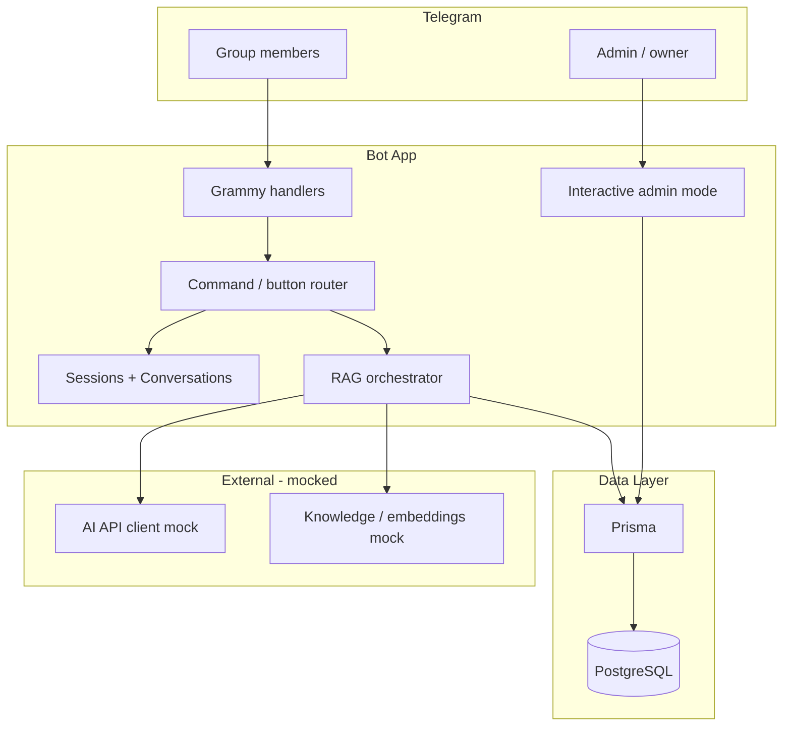

# Telegram RAG Bot — Development Plan

> Living document. Updated with decision snapshots at each implementation checkpoint so development can be resumed from any phase.

---

## Confirmed Design Decisions (2026-06-29)

| # | Decision | Choice | Rationale |
|---|----------|--------|-----------|
| 1 | Bot framework | **Grammy** | TypeScript-first, stable, excellent plugins for sessions, conversations, menus |
| 2 | Multi-bot model | **Single repo, schema supports many bots** | One process runs one `BOT_INSTANCE_ID` via env; schema ready for multiple instances |
| 3 | Primary context | **Groups + DMs** | Group messages stored for RAG; privacy mode documented in README |
| 4 | Admin auth | **Env allowlist `ADMIN_USER_IDS`** | No login UI in v1; Telegram user ID check on `/admin` |
| 5 | AI integration | **Fixed in-process mock** | `AiClient` interface ready; user will plug real API later |
| 6 | Project path | **`/Users/zarincheg/Projects/tmp/telegram-rag-bot`** | Greenfield skeleton in workspace |
| 7 | Database | **PostgreSQL + Prisma** | As requested |
| 8 | Local dev | **Docker Compose Postgres + polling mode** | No webhook needed for local testing |

---

## Architecture



---

## Project Structure

```
telegram-rag-bot/
├── PLAN.md                     # This file
├── docker-compose.yml
├── .env.example
├── package.json
├── prisma/
│   └── schema.prisma
├── src/
│   ├── index.ts
│   ├── config/
│   ├── bot/
│   │   ├── bot.ts
│   │   ├── middleware/
│   │   ├── handlers/
│   │   ├── conversations/
│   │   └── keyboards/
│   ├── admin/
│   ├── services/
│   │   └── ai-client/
│   ├── db/
│   └── types/
└── scripts/
    └── seed.ts
```

---

## Data Model

| Model | Purpose |
|-------|---------|
| `BotInstance` | Multi-bot support: name, settings JSON |
| `BotCommand` | Configurable commands |
| `BotButton` | Inline/reply button definitions |
| `DataSource` | RAG sources (URL, file, manual text) |
| `ChatMessage` | Per-chat history for RAG context |
| `KnowledgeChunk` | Retrieved chunks (mock seed data) |
| `AdminSession` | Admin conversation state (optional) |

---

## Implementation Phases

| Phase | Status | Deliverable |
|-------|--------|-------------|
| 1. Scaffold | **done** | package.json, tsconfig, Grammy bot, Docker Postgres |
| 2. Prisma + seed | **done** | Schema, migrations, seed data |
| 3. Demo UX | **done** | Keyboards, callbacks, conversations |
| 4. RAG mock | **done** | Chat history, retrieval mock, AI client mock |
| 5. Admin mode | **done** | `/admin` conversation + config CRUD |
| 6. Polish | **done** | Error handling, logging, tests, README |

---

## Out of Scope (v1)

- Real embeddings / vector DB (pgvector = phase 2)
- Webhook + production deploy
- Full document ingestion pipeline
- Multi-tenant hosting dashboard
- HTTP mock server for AI API

---

## Implementation Snapshots

### Snapshot 1 — Phase 1: Scaffold (2026-06-29)

**Completed:**
- `package.json` with Grammy, Prisma, Zod, Vitest, tsx
- `tsconfig.json` (ES2022, NodeNext modules)
- `docker-compose.yml` — Postgres 16 on port 5432
- `.env.example`, `.gitignore`
- Entry point `src/index.ts` with graceful shutdown

**Decisions:**
- Node 20+ required
- Long-polling for local dev (no webhook setup)
- ESM (`"type": "module"`)

**Resume from here:** Run `npm install`, `docker compose up -d`, copy `.env.example` → `.env`

---

### Snapshot 2 — Phase 2: Prisma + Seed (2026-06-29)

**Completed:**
- `prisma/schema.prisma` — 6 models: BotInstance, BotCommand, BotButton, DataSource, ChatMessage, KnowledgeChunk
- Migration `20260629212226_init` applied
- `scripts/seed.ts` — seeds `default` instance with 7 commands, 6 buttons, 3 FAQ chunks

**Decisions:**
- `BotInstance.slug` used for `BOT_INSTANCE_ID` env lookup (not internal cuid)
- `BotInstance.settings` stored as JSON (ragEnabled, responseStyle, etc.)
- Seed uses fixed id `seed-manual-faq` for idempotent DataSource upsert
- Buttons re-created on each seed (delete + create) to avoid duplicates

**Resume from here:** `npm run db:migrate && npm run db:seed`

---

### Snapshot 3 — Phase 3: Demo UX (2026-06-29)

**Completed:**
- `src/bot/context.ts` — `BotContext` = Context + Session + Conversation flavors
- Inline keyboards (`buildInlineKeyboard`) and reply keyboards (`buildReplyKeyboard`)
- Callback handler for button actions: faq, ask_ai, report_issue, show_help
- Conversations: `reportIssueConversation`, `askAiConversation`
- Commands: `/start`, `/help`, `/ask`, `/report`, `/digest`, `/ping`, `/admin`
- Group mention handler: `@bot question` triggers RAG in groups

**Decisions:**
- `@grammyjs/conversations` for multi-step dialogs
- In-memory session (no Prisma session store in v1)
- Reply keyboard "Hide keyboard" handled as plain text
- Callback data format: `action:<actionType>:<buttonId>`

**Resume from here:** Set `BOT_TOKEN` in `.env`, run `npm run dev`, message bot `/start`

---

### Snapshot 4 — Phase 4: RAG Mock (2026-06-29)

**Completed:**
- `src/services/ai-client/types.ts` — `AiClient` interface
- `src/services/ai-client/mock.client.ts` — fixed in-process mock (confirmed decision #5)
- `src/services/chat-history.service.ts` — stores/retrieves messages per chat
- `src/services/rag.service.ts` — orchestrates history + keyword retrieval + mock AI
- Keyword-based mock retrieval (no embeddings); falls back to first 2 chunks

**Decisions:**
- No HTTP mock server — mock is a class implementing `AiClient`
- Chat history stored on every `/ask` and mention-triggered question
- RAG can be disabled via admin settings (`ragEnabled: false`)
- Sources appended to answer footer when chunks are found

**Resume from here:** Replace `MockAiClient` with real client; swap `retrieveKnowledge` for vector search later

---

### Snapshot 5 — Phase 5: Admin Mode (2026-06-29)

**Completed:**
- `src/admin/admin-conversation.ts` — interactive menu (commands, buttons, data sources, settings)
- `src/services/bot-config.service.ts` — CRUD + 30s config cache
- Admin guarded by `ADMIN_USER_IDS` env allowlist

**Admin commands (text-based within conversation):**
- Commands: `add <name> | <desc>`, `toggle <name>`
- Buttons: `add <label> | <actionType>`, `toggle <label>`
- Data sources: `add <name> | <URL|FILE|MANUAL> | <location>`, `activate <name>`
- Settings: `toggle rag`, `style concise|detailed`, `toggle digest`

**Decisions:**
- Text-based admin UI (no inline menus in admin mode) for simplicity
- Config cache invalidated on any write
- Data sources created as PENDING; manual activate step (ingestion stub)

**Resume from here:** Add your Telegram user ID to `ADMIN_USER_IDS`, send `/admin`

---

### Snapshot 6 — Phase 6: Polish (2026-06-29)

**Completed:**
- Logger middleware (`LOG_LEVEL` env)
- Global error handler with user-facing fallback message
- `src/services/rag.service.test.ts` — 2 unit tests (RAG enabled/disabled)
- `README.md` — setup, group tips, command reference
- `npm run build` passes; `npm run test` passes (2/2)

**Decisions:**
- Vitest for unit tests (service layer only; no Telegram API integration tests in v1)
- `BotConfigService` cast settings via `Prisma.InputJsonValue`
- `Conversation<BotContext, BotContext>` typing for conversations plugin compatibility

**Resume from here:** Project is runnable. See README Quick Start.

---

## Quick Start (current state)

```bash
cd telegram-rag-bot
npm install
docker compose up -d
cp .env.example .env   # set BOT_TOKEN and ADMIN_USER_IDS
npm run db:migrate
npm run db:seed
npm run dev
```

### Snapshot 7 — Local test run fix (2026-06-29)

**Issue:** `npm run db:seed` failed with `Environment variable not found: DATABASE_URL` because the seed script did not load `.env`. User's `BOT_INSTANCE_ID=cronomad` also did not match hardcoded `default` slug in seed.

**Fix:**
- Added `import "dotenv/config"` to `scripts/seed.ts`
- Seed now uses `BOT_INSTANCE_ID` from `.env` (falls back to `default`)
- Data source id scoped per instance: `seed-manual-faq-<slug>`
- Added `scripts/smoke-test.ts` + `npm run smoke-test` for DB/RAG/Telegram verification

**Verified:**
- Seed: `cronomad` instance with 7 commands, 6 buttons, 3 chunks
- Smoke test: RAG mock answer, `@cronomad_bot` token valid, ping sent to admin
- Bot running: `npm run dev` → `@cronomad_bot is running`

**Resume from here:** `npm run db:seed && npm run dev`

---

### Snapshot 8 — Chat history ingestion pipeline (2026-06-29)

**Confirmed decisions:**
- Full group capture with extensible filter middleware
- Export to external RAG API only (no local KnowledgeChunk mirror)
- `RagIngestClient` mock + stub HTTP client for later contract
- Manual `syncChatIds` allowlist (admin: Register this group)
- Configurable interval, default 6h
- Raw chunks first (no summarization)
- Group Privacy off required; no DM capture by default
- In-process scheduler (dev) + `npm run job:sync-chats` (prod cron)

**Implemented:**
- `CapturePipeline` + default filters (`no_dm`, `allowlisted_chat`, `skip_commands`, etc.)
- `MessageCaptureService`, `ChunkBuilderService`, `ChatSyncService`
- `MockRagIngestClient` / `HttpRagIngestClient` in `rag-ingest.client.ts`
- Prisma: `ChatSyncState`, `IngestionRun`, `ChatMessage.syncedAt/capturedFrom`
- Admin: 🔄 Chat sync panel (enable, interval, register group, run now)
- `SYNC_SCHEDULER_ENABLED`, `RAG_INGEST_URL` env vars

**Resume from here:**
1. `/admin` → Chat sync → Register group → Enable sync
2. `npm run job:sync-chats` or `SYNC_SCHEDULER_ENABLED=true`
3. Replace `HttpRagIngestClient` body when RAG API contract is ready

---

## Product roadmap (Phases A–D)

Full implementation plan with schema, file-level tasks, PR stack, and estimates: **[PRODUCT-PLAN.md](./PRODUCT-PLAN.md)**

| Phase | Focus |
|-------|--------|
| A | RAG query client + per-group scope |
| B | Source ingestion worker + admin status |
| C | Per-group settings + trigger policy |
| D | Community answers, citations, promote to KB |

---

## Next Steps (suggested)

1. Confirm [PRODUCT-PLAN.md](./PRODUCT-PLAN.md) decisions, then implement Phase A
2. Implement real `AiClient` pointing to your RAG API
2. Add pgvector column to `KnowledgeChunk` for semantic search
3. Build ingestion worker for `DataSource` rows
4. Add Prisma-backed session store for production
5. Webhook mode + deploy (Railway, Fly.io, etc.)