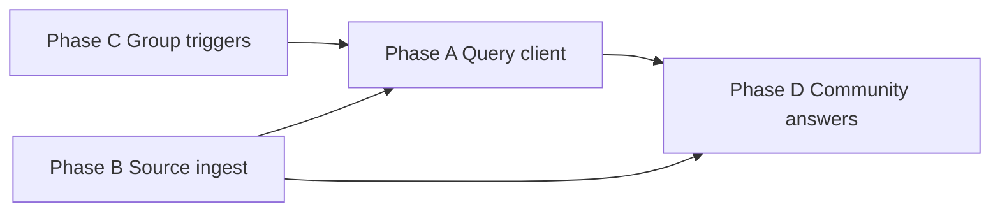

# Product Implementation Plan — Phases A–D

> Goal: evolve the skeleton into a **community group expert** bot (beyond the AI/RAG API itself).  
> Prerequisite: your external RAG service exposes **ingest** (exists as stub) and **query** (new) endpoints.

**Product pillars covered by A–D:**

| Pillar | Phase |
|--------|-------|
| Answer from real community knowledge | A |
| Community-managed content sources | B |
| Per-group expert personality & triggers | C |
| Human answers, citations, promotion to KB | D |

---

## Target architecture (after A–D)

```mermaid
flowchart TB
    subgraph telegram [Telegram]
        Group[Group chat]
        DM[Admin DM]
    end

    subgraph bot [Bot App]
        Triggers[Trigger policy]
        RagOrch[RagOrchestrator]
        QueryClient[RagQueryClient]
        AiClient[AiClient]
        IngestWorker[SourceIngestWorker]
        ChatSync[ChatSyncService]
        Community[CommunityAnswerService]
        GroupCfg[GroupConfigService]
    end

    subgraph db [(PostgreSQL)]
        ManagedGroup
        GroupSettings
        DataSource
        CommunityAnswer
        QuestionLog
    end

    subgraph rag [Your RAG API]
        Ingest[/ingest/chunks]
        Query[/query/search]
    end

    Group --> Triggers --> RagOrch
    RagOrch --> QueryClient --> Query
    RagOrch --> AiClient
    ChatSync --> Ingest
    IngestWorker --> Ingest
    DM --> GroupCfg --> ManagedGroup
    Group --> Community
    Community --> Ingest
    RagOrch --> db
```

---

## Shared API contracts (you will adapt later)

### Query (new — Phase A)

```typescript
// POST {RAG_QUERY_URL}/query/search
interface RagQueryRequest {
  botInstanceId: string;
  botInstanceSlug: string;
  chatId?: string;           // scope to group KB
  query: string;
  topK?: number;
  filters?: {
    sourceTypes?: string[];
    minScore?: number;
  };
}

interface RagQueryResponse {
  results: Array<{
    id: string;
    title: string | null;
    content: string;
    score: number;
    metadata?: Record<string, unknown>;
  }>;
}
```

### Ingest (existing stub — Phases B/D)

Already shaped in `src/services/ingestion/rag-ingest.client.ts` (`IngestChunkBatch`). Extend metadata in Phase D for `sourceType: "community_answer"`.

---

## Phase A — RAG query client + per-group scope

**Outcome:** Bot answers using your RAG API, scoped per group. Local `KnowledgeChunk` keyword mock becomes fallback only.

### A.1 Schema changes

None required. Optional: deprecate direct reads from `KnowledgeChunk` in `RagService` (keep table for offline fallback/dev).

### A.2 New / modified files

| File | Action |
|------|--------|
| `src/services/rag/rag-query.client.ts` | **New** — `RagQueryClient`, `MockRagQueryClient`, `HttpRagQueryClient` |
| `src/services/rag/rag-orchestrator.ts` | **New** — extract orchestration from `RagService` (query → AI → format) |
| `src/services/rag.service.ts` | **Refactor** — thin wrapper delegating to orchestrator |
| `src/config/env.ts` | Add `RAG_QUERY_URL`, `RAG_QUERY_API_KEY`, `RAG_QUERY_TOP_K` |
| `src/services/ai-client/types.ts` | Extend `RagContext` with `chatId`, `groupTitle?`, `scopes` |
| `src/bot/handlers/messages.ts` | Pass `chatId` scope into RAG calls (already have chatId) |
| `src/services/rag.service.test.ts` | Update + add query client tests |
| `scripts/smoke-test.ts` | Verify query path |
| `.env.example` | Document query env vars |

### A.3 Implementation tasks

| # | Task | Detail |
|---|------|--------|
| A.3.1 | Define `RagQueryClient` interface | `search(request): Promise<KnowledgeSource[]>` |
| A.3.2 | Mock query client | Return deterministic results; log query + scope |
| A.3.3 | HTTP query client | Stub `POST /query/search`; you adjust path/body later |
| A.3.4 | Factory | `createRagQueryClient()` — mock if `RAG_QUERY_URL` unset |
| A.3.5 | Replace `retrieveKnowledge()` | Call query client with `chatId` from params |
| A.3.6 | Fallback strategy | If query returns empty → optional local `KnowledgeChunk` fallback (config flag) |
| A.3.7 | Answer footer | Show source titles + scores from API metadata |
| A.3.8 | Error handling | RAG down → user-safe message, log error, no mock internals in reply |

### A.4 Exit criteria

- [ ] `/ask` and `@mention` in allowlisted group use `RagQueryClient`
- [ ] Query request includes `botInstanceId` + `chatId`
- [ ] Mock + HTTP clients behind same interface
- [ ] Tests pass; smoke test logs query scope
- [ ] `npm run build` clean

### A.5 Estimate: **2–3 days**

---

## Phase B — Source ingestion worker + admin status

**Outcome:** Community admins add URL/FILE/MANUAL sources; worker ingests into RAG API; status visible in admin.

### B.1 Schema changes

```prisma
model DataSource {
  // existing fields +
  chatId         BigInt?          // optional: source scoped to one group
  lastIngestedAt DateTime?
  lastError      String?
  chunkCount     Int              @default(0)
  ingestJobId    String?          // last job id from RAG API
}

model SourceIngestionRun {
  id            String   @id @default(cuid())
  botInstanceId String
  dataSourceId  String
  startedAt     DateTime @default(now())
  finishedAt    DateTime?
  status        String   // running | success | failed
  chunksSent    Int      @default(0)
  error         String?

  @@index([dataSourceId, startedAt])
}
```

### B.2 New / modified files

| File | Action |
|------|--------|
| `prisma/schema.prisma` | Add fields + `SourceIngestionRun` |
| `src/services/ingestion/source-fetchers/` | **New dir** — `url.fetcher.ts`, `file.fetcher.ts`, `manual.fetcher.ts` |
| `src/services/ingestion/source-chunker.service.ts` | **New** — raw text → `IngestChunk[]` (reuse chunk builder patterns) |
| `src/services/ingestion/source-ingest.service.ts` | **New** — orchestrate fetch → chunk → `RagIngestClient` |
| `src/jobs/run-source-ingest.ts` | **New** — CLI: ingest one or all PENDING sources |
| `src/services/scheduler/source-ingest-scheduler.ts` | **New** — optional periodic ingest (e.g. every 12h) |
| `src/admin/admin-conversation.ts` | Data sources: Ingest now, view last run, error |
| `src/admin/keyboards.ts` | Buttons: `adm:d:i:<id>`, `adm:d:s:<index>` status |
| `src/admin/format.ts` | Show ingest status per source |
| `src/services/bot-config.service.ts` | `triggerSourceIngest(id)` helper |
| `package.json` | `job:ingest-sources` script |

### B.3 Implementation tasks

| # | Task | Detail |
|---|------|--------|
| B.3.1 | URL fetcher | `fetch(location)` → plain text (start with HTTP GET + strip HTML; upgrade to readability later) |
| B.3.2 | Manual fetcher | `location` is raw text or file path in dev |
| B.3.3 | File fetcher | Stub for local path; later S3/Telegram document |
| B.3.4 | Source chunker | Split by headings/paragraphs; max chunk size ~2k chars |
| B.3.5 | Ingest service | PENDING → running → ACTIVE/ERROR; write `SourceIngestionRun` |
| B.3.6 | Idempotent ingest | `externalId` = hash(dataSourceId + chunkIndex) |
| B.3.7 | Admin UX | Per source: status icon, "Ingest now", last error |
| B.3.8 | Link to group | Optional `chatId` on source when created from group admin context |
| B.3.9 | Scheduler | `SOURCE_INGEST_SCHEDULER_ENABLED` env (off by default) |

### B.4 Exit criteria

- [ ] Admin adds MANUAL source → "Ingest now" → mock ingest logs chunks → status ACTIVE
- [ ] URL source fetches and ingests (at least simple HTML pages)
- [ ] Failed ingest sets ERROR + `lastError` visible in admin
- [ ] `npm run job:ingest-sources` processes all PENDING
- [ ] Ingested content retrievable via Phase A query (once API connected)

### B.5 Estimate: **4–5 days**

---

## Phase C — Per-group settings + trigger policy

**Outcome:** Each group feels like its own expert: topic profile, tone, when the bot speaks, cooldowns.

### C.1 Schema changes

```prisma
model ManagedGroup {
  // existing fields +
  settings Json @default("{}")   // GroupSettings blob
  topic    String?                // short description for prompts
}

// GroupSettings (TypeScript, stored in JSON):
interface GroupSettings {
  ragEnabled: boolean;
  captureEnabled: boolean;
  syncEnabled: boolean;
  proactiveEnabled: boolean;
  triggers: TriggerPolicy;
  responseStyle: "concise" | "detailed";
  welcomeMessage?: string;
  expertPersona?: string;         // "You are a helper for our cycling club..."
}

interface TriggerPolicy {
  onMention: boolean;              // default true
  onReplyToBot: boolean;           // default true
  onQuestionHeuristic: boolean;    // default false
  questionPatterns?: string[];     // regex strings
  cooldownSeconds: number;         // default 30
  maxRepliesPerHour: number;       // default 20
}
```

### C.2 New / modified files

| File | Action |
|------|--------|
| `src/types/group-settings.ts` | **New** — types + defaults |
| `src/services/group-config.service.ts` | **New** — read/update per-group settings |
| `src/services/trigger/trigger-policy.service.ts` | **New** — shouldRespond(ctx, settings) |
| `src/services/trigger/question-heuristic.ts` | **New** — `?`, "how", "where", "как" etc. |
| `src/services/trigger/rate-limiter.ts` | **New** — per-chat cooldown (in-memory → Redis later) |
| `src/bot/handlers/messages.ts` | Use trigger policy instead of mention-only |
| `src/services/rag.service.ts` | Merge global + group settings for style/persona |
| `src/services/capture/message-capture.service.ts` | Respect per-group `captureEnabled` |
| `src/services/ingestion/chat-sync.service.ts` | Respect per-group `syncEnabled` |
| `src/admin/admin-conversation.ts` | Group detail: topic, persona, triggers, toggles |
| `src/admin/keyboards.ts` | Group settings sub-keyboard |
| `src/admin/format.ts` | Group settings text |
| `src/services/group-registry.service.ts` | Delegate settings to `GroupConfigService` |

### C.3 Implementation tasks

| # | Task | Detail |
|---|------|--------|
| C.3.1 | Migrate sync allowlist | `syncChatIds` ↔ `ManagedGroup.settings.syncEnabled` (keep in sync) |
| C.3.2 | Group defaults | New group inherits bot-global defaults |
| C.3.3 | Trigger service | Central gate before `ragService.answer()` |
| C.3.4 | Reply-to-bot detection | `ctx.message.reply_to_message?.from?.id === botId` |
| C.3.5 | Question heuristic | Off by default; admin toggle per group |
| C.3.6 | Rate limiter | Skip reply + optional debug log when throttled |
| C.3.7 | Persona in AI context | Pass `expertPersona` + `topic` in `RagContext` system preamble |
| C.3.8 | Admin group panel | Edit topic, persona (text), trigger toggles, style |
| C.3.9 | DM-first workflow | All group-specific config from group detail in DM admin |

### C.4 Exit criteria

- [ ] Two groups can have different `ragEnabled` / trigger settings
- [ ] Bot responds on reply-to-bot when enabled
- [ ] Cooldown prevents spam in active chats
- [ ] Group topic/persona included in AI request context
- [ ] Capture/sync respect per-group flags

### C.5 Estimate: **4–5 days**

---

## Phase D — Community answers, citations, promotion to KB

**Outcome:** Bot cites participants, moderators promote good human answers into the knowledge base.

### D.1 Schema changes

```prisma
enum CommunityAnswerStatus {
  CANDIDATE
  APPROVED
  REJECTED
  INGESTED
}

model CommunityAnswer {
  id              String   @id @default(cuid())
  botInstanceId   String
  chatId          BigInt
  sourceMessageId BigInt   // Telegram message_id promoted
  sourceUserId    BigInt?
  sourceUsername  String?
  content         String
  title           String?  // optional FAQ title
  status          CommunityAnswerStatus @default(CANDIDATE)
  endorsedById    BigInt?  // admin/mod who approved
  ingestedAt      DateTime?
  externalChunkId String?  // id in RAG service
  createdAt       DateTime @default(now())
  updatedAt       DateTime @updatedAt

  @@unique([botInstanceId, chatId, sourceMessageId])
  @@index([botInstanceId, chatId, status])
}

model QuestionLog {
  id            String   @id @default(cuid())
  botInstanceId String
  chatId        BigInt
  userId        BigInt?
  question      String
  normalized    String   // for clustering
  answerSource  String   // rag | community | none
  communityAnswerId String?
  ragScore      Float?
  createdAt     DateTime @default(now())

  @@index([botInstanceId, chatId, createdAt])
  @@index([botInstanceId, normalized])
}
```

### D.2 New / modified files

| File | Action |
|------|--------|
| `src/services/community/community-answer.service.ts` | **New** — CRUD, approve, ingest |
| `src/services/community/citation-formatter.ts` | **New** — `@user`, date, link to message |
| `src/services/community/question-log.service.ts` | **New** — log Q&A for analytics (Phase E prep) |
| `src/services/rag/rag-orchestrator.ts` | Merge RAG results + approved `CommunityAnswer` hits |
| `src/bot/handlers/community-actions.ts` | **New** — reply-to-message promote flow |
| `src/bot/handlers/commands.ts` | `/promote` (reply to message), `/cite` demo |
| `src/admin/admin-conversation.ts` | Community tab: pending approvals per group |
| `src/admin/keyboards.ts` | Approve/reject buttons |
| `src/jobs/promote-community-answers.ts` | Batch ingest APPROVED → RAG API |

### D.3 Implementation tasks

| # | Task | Detail |
|---|------|--------|
| D.3.1 | Promote flow | Admin replies `/promote` to a message → creates CANDIDATE |
| D.3.2 | Admin approval | DM admin: list CANDIDATE → Approve / Reject |
| D.3.3 | Ingest on approve | Approved answer → `RagIngestClient` with `metadata.sourceType: community_answer` |
| D.3.4 | Citation in answers | When query hits community chunk → footer cites @username |
| D.3.5 | Hybrid retrieval | Query RAG API + local approved answers; merge by score |
| D.3.6 | Question logging | Log every bot Q&A to `QuestionLog` |
| D.3.7 | Thread context | Store `reply_to_message_id` in `QuestionLog`; pass thread snippet to orchestrator |
| D.3.8 | Report issue persist | Wire existing report dialog → `QuestionLog` or ticket table |

### D.4 User flows

**Promote human answer:**
1. Member gives good answer in group
2. Mod replies to that message: `/promote` or button "Save to KB"
3. Bot: "Queued for review" (CANDIDATE)
4. Admin in DM → Community → Approve
5. Worker ingests to RAG → status INGESTED
6. Future questions retrieve this answer with citation

**Bot cites community:**
```
Based on the community wiki and @alice's answer from Mar 12:
...
Sources: Onboarding guide; @alice
```

### D.5 Exit criteria

- [ ] `/promote` on reply creates CANDIDATE
- [ ] Admin can approve from DM
- [ ] Approved answer ingested via existing ingest client
- [ ] Bot answer includes citation when community source used
- [ ] Questions logged for later FAQ analytics

### D.6 Estimate: **5–6 days**

---

## Dependency graph



| Phase | Depends on | Can parallelize with |
|-------|------------|----------------------|
| A | — | B (partially) |
| B | Ingest API (stub OK) | A |
| C | A (for persona in context) | B |
| D | A + B (ingest path) | — |

**Recommended order:** A → B → C → D (or A ∥ B, then C, then D).

---

## PR breakdown (Graphite-style stack)

| PR | Phase | Title |
|----|-------|-------|
| PR-1 | A | `feat(rag): RagQueryClient + orchestrator refactor` |
| PR-2 | A | `feat(rag): per-group query scope + fallback` |
| PR-3 | B | `feat(ingest): schema + source fetchers + chunker` |
| PR-4 | B | `feat(ingest): source ingest worker + admin UX` |
| PR-5 | C | `feat(groups): GroupSettings schema + config service` |
| PR-6 | C | `feat(triggers): policy engine + rate limiter` |
| PR-7 | C | `feat(admin): per-group settings panel` |
| PR-8 | D | `feat(community): CommunityAnswer model + promote flow` |
| PR-9 | D | `feat(community): approval UI + ingest + citations` |
| PR-10 | D | `feat(analytics): QuestionLog + thread context` |

---

## Config & env (cumulative after A–D)

```bash
# Phase A
RAG_QUERY_URL=
RAG_QUERY_API_KEY=
RAG_QUERY_TOP_K=5
RAG_FALLBACK_LOCAL=true

# Phase B
SOURCE_INGEST_SCHEDULER_ENABLED=false
SOURCE_MAX_CHUNK_CHARS=2000

# Phase C
# (mostly DB-driven per group)

# Phase D
COMMUNITY_AUTO_INGEST_ON_APPROVE=true
```

---

## Out of scope for A–D (Phase E+)

- FAQ clustering / auto-suggest from `QuestionLog`
- Proactive digest scheduler (wire `proactiveDigestEnabled`)
- 👍/👎 feedback
- Web dashboard
- Webhook production deploy
- pgvector local fallback
- Multi-process multi-bot hosting

---

## Decisions to confirm before implementation

| # | Question | Proposal |
|---|----------|----------|
| 1 | Query + ingest on same RAG base URL? | Separate `RAG_QUERY_URL` / `RAG_INGEST_URL` (can be same host) |
| 2 | Per-group KB isolation | Required `chatId` filter on every query |
| 3 | Local `KnowledgeChunk` fallback | Keep as dev fallback only (`RAG_FALLBACK_LOCAL=true`) |
| 4 | URL ingestion depth v1 | Simple HTML strip; no headless browser initially |
| 5 | Promote permissions | Admins only, or group moderators list per `ManagedGroup`? |
| 6 | Question heuristic default | Off per group; admin enables |
| 7 | Approved answers need manual review? | Yes — CANDIDATE → APPROVED workflow |
| 8 | Plan file location | This document: `PRODUCT-PLAN.md` |

---

## Total estimate

| Phase | Days |
|-------|------|
| A | 2–3 |
| B | 4–5 |
| C | 4–5 |
| D | 5–6 |
| **Total** | **~15–19 days** |

---

## Resume checklist (after each phase)

1. Update `PLAN.md` snapshot section
2. Run `npm run build && npm run test`
3. Run `npm run smoke-test`
4. Manual Telegram test in DM + one group
5. Document new env vars in `.env.example`