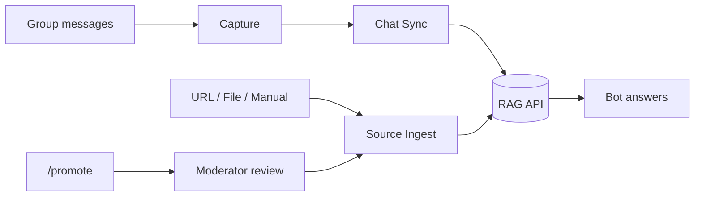

# Features

## Member-facing

### Commands

| Command | Where | Description |
|---------|-------|-------------|
| `/start` | DM or group | Welcome message + action buttons |
| `/help` | Anywhere | Dynamic help from database |
| `/ask <question>` | Anywhere | Ask the knowledge base |
| `/ping` | Anywhere | Health check (`pong`) |
| `/digest` | Anywhere | Daily tip from knowledge chunks |
| `/report` | Anywhere | Multi-step issue report dialog |
| `/promote` | Group | Moderators: save a replied-to message as community knowledge |

### Buttons

Configurable inline and reply keyboards (FAQ, Ask AI, Report, Help). Managed in `/admin` → **Buttons**.

### Group triggers

The bot can respond when (per-group configurable):

- A message **@mentions** the bot
- A member **replies** to a bot message
- **Question heuristic** detects a question (off by default)

Rate limits apply per group (cooldown + max replies per hour).

---

## Admin-facing (`/admin` in DM)

Global admins (`ADMIN_USER_IDS`) get the full panel:

| Section | Capabilities |
|---------|--------------|
| **Commands** | Add, enable/disable bot commands |
| **Buttons** | Add, enable/disable keyboard buttons |
| **Data sources** | Add URL/FILE/MANUAL sources, activate, ingest |
| **Settings** | Global RAG toggle, response style, digest |
| **Groups** | List groups, sync allowlist, per-group settings, moderators |
| **Chat sync** | Enable periodic sync, capture, interval, run now |
| **Community** | Approve/reject promoted answers |

---

## Moderator-facing (`/mod` in DM)

Group moderators (per-group list) can:

- Review **pending community answers** promoted via `/promote`
- Approve (ingests to RAG when configured) or reject

Global admins always have moderator rights in every group.

---

## Per-group settings

Each managed group can have independent:

| Setting | Purpose |
|---------|---------|
| RAG enabled | Turn answers on/off for this group |
| Capture enabled | Store group messages for history/sync |
| Sync enabled | Include in periodic RAG ingest |
| Triggers | Mention, reply-to-bot, question heuristic |
| Topic | Short description for AI context |
| Expert persona | Custom system tone for this community |
| Response style | Concise or detailed |
| Moderators | User IDs with promote/approve rights |

---

## Knowledge pipeline

### Without external RAG

- **Query:** mock client returns sample results; optional local `KnowledgeChunk` fallback
- **Ingest:** mock client logs chunks (visible in container logs)
- **AI:** mock client generates placeholder answers

The bot service is fully functional for testing admin flows, capture, sync scheduling, and community moderation.

---

## Background jobs

| Job | Command | Purpose |
|-----|---------|---------|
| Chat sync | `npm run job:sync-chats` | Export captured messages to RAG ingest API |
| Source ingest | `npm run job:ingest-sources` | Process pending URL/FILE/MANUAL sources |

In production Docker, use optional worker containers or cron — see [Operations](../operations.md).