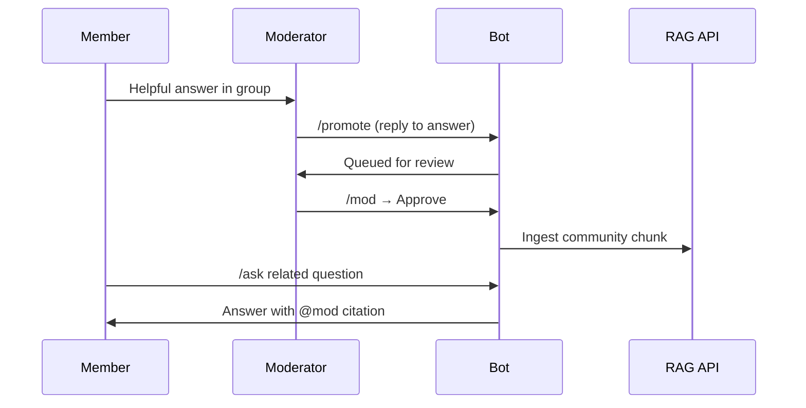

# Moderation Guide

Community knowledge lets **human answers** become part of the searchable knowledge base — with moderator review.

## Roles

| Role | How assigned | Permissions |
|------|--------------|-------------|
| **Global admin** | `ADMIN_USER_IDS` env var | Full `/admin` panel + moderator rights everywhere |
| **Group moderator** | `/admin` → Groups → Moderators | `/promote` in group, `/mod` in DM for their groups |

---

## Promote a good answer

When a member writes a helpful reply in the group:

1. **Moderator** replies to that message with `/promote`
2. Bot confirms: *"Queued for review"*
3. A `CANDIDATE` record is created in the database

Requirements:

- Must be a **reply** to the message being promoted
- Promoted message must contain **text**
- Caller must be a group moderator or global admin

---

## Review and approve

### Option A — Moderator panel (`/mod`)

1. Moderator opens **DM** with the bot
2. Sends `/mod`
3. Sees pending candidates for groups they moderate
4. Tap **✅** to approve or **❌** to reject

### Option B — Admin panel (`/admin`)

1. Global admin sends `/admin` in DM
2. Tap **💬 Community**
3. Approve or reject any pending candidate

### On approval

When `COMMUNITY_AUTO_INGEST_ON_APPROVE=true` (default):

1. Status → `APPROVED` → `INGESTED`
2. Content sent to RAG ingest API with `sourceType: community_answer`
3. Future `/ask` and mentions can retrieve it with **@username citation**

---

## Workflow diagram

---

## Best practices

- Add **2–3 trusted moderators** per active group
- Promote **factual, timeless** answers (policies, FAQs, how-tos)
- Avoid promoting opinions or time-sensitive info without context
- Use **data sources** for official docs; use **promote** for community wisdom

---

## Troubleshooting

| Issue | Solution |
|-------|----------|
| `/promote` denied | Add user ID in Group → Moderators |
| `/mod` says not moderator | Same — or use global admin |
| Approved but not in answers | Check `RAG_INGEST_URL`; verify ingest logs; query API must index `chatId` |