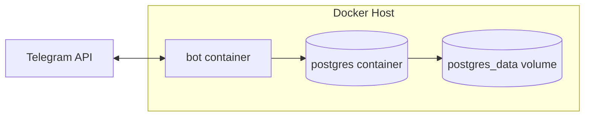

# Docker Deployment

Production stack: **PostgreSQL 16** + **bot** in one Compose file.

## Files

| File | Purpose |
|------|---------|
| `Dockerfile` | Multi-stage production image |
| `docker-compose.yml` | Dev — Postgres only |
| `docker-compose.prod.yml` | Prod — Postgres + bot (+ optional workers) |
| `docker/entrypoint.sh` | Migrate on start, optional seed, run bot |
| `.env.prod.example` | Production env template |

## Quick deploy

```bash
cp .env.prod.example .env.prod
```

Edit `.env.prod` — minimum required:

```bash
BOT_TOKEN=...
ADMIN_USER_IDS=...
POSTGRES_PASSWORD=<strong-password>
```

Build and start:

```bash
docker compose -f docker-compose.prod.yml --env-file .env.prod up -d --build
```

First deploy with seed FAQ data:

```bash
# Add to .env.prod: RUN_DB_SEED=true
docker compose -f docker-compose.prod.yml --env-file .env.prod up -d --build
# Remove RUN_DB_SEED after first successful start
```

Verify:

```bash
docker compose -f docker-compose.prod.yml logs -f bot
# Expect: [bot] @your_bot is running
```

---

## Architecture



| Service | Image | Port exposed |
|---------|-------|--------------|
| `postgres` | `postgres:16-alpine` | None (internal only) |
| `bot` | Built from `Dockerfile` | None (outbound polling) |

**Do not expose Postgres** to the public internet in production.

---

## Optional worker profile

For production, prefer dedicated workers over in-process `SYNC_SCHEDULER_ENABLED`:

```bash
docker compose -f docker-compose.prod.yml --env-file .env.prod --profile workers up -d
```

| Worker | Default interval | Env override |
|--------|------------------|--------------|
| `sync-worker` | 6 hours | `SYNC_INTERVAL_SECONDS` |
| `source-ingest-worker` | 12 hours | `INGEST_INTERVAL_SECONDS` |

Set `SYNC_SCHEDULER_ENABLED=false` in `.env.prod` when using `sync-worker`.

---

## Image details

- **Base:** `node:20-alpine`
- **User:** `node` (non-root)
- **Init:** `tini` for signal handling
- **Migrations:** automatic via `prisma migrate deploy`
- **Healthcheck:** process alive (extend for HTTP if you add a health endpoint)

### Build locally

```bash
docker build -t telegram-rag-bot:latest .
```

### Push to registry

```bash
docker tag telegram-rag-bot:latest registry.example.com/telegram-rag-bot:v1.0.0
docker push registry.example.com/telegram-rag-bot:v1.0.0
```

Set `BOT_IMAGE=registry.example.com/telegram-rag-bot:v1.0.0` in `.env.prod` to pull instead of build.

---

## Upgrades

```bash
git pull
docker compose -f docker-compose.prod.yml --env-file .env.prod up -d --build
```

Migrations run on container start. Check logs for migration errors.

---

## Resource sizing

| Scale | CPU | RAM | Disk |
|-------|-----|-----|------|
| Small (1–5 groups) | 0.5 vCPU | 512 MB bot + 256 MB PG | 5 GB |
| Medium (10–50 groups) | 1 vCPU | 1 GB bot + 1 GB PG | 20 GB |

Capture volume grows with message retention — tune `retentionDays` in bot settings.

---

## See also

- [Production Checklist](production-checklist.md)
- [CI/CD GitHub](ci-cd-github.md) / [CI/CD GitLab](ci-cd-gitlab.md)
- [Operations](../operations.md)